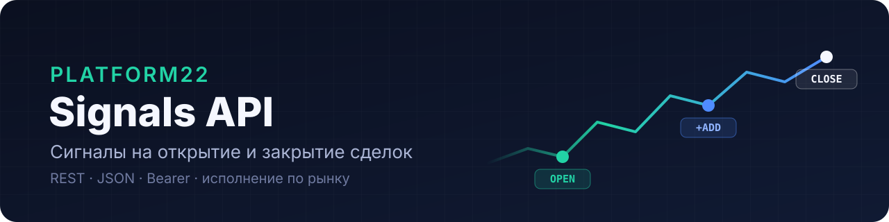
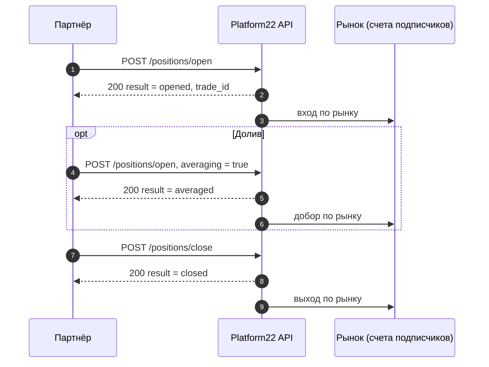

<p align="center">
  
</p>

<p align="center">
  <a href="CHANGELOG.md"></a>
  <a href="docs/openapi.yaml"></a>
  <a href="#тестовый-и-боевой-контуры"></a>
  <a href="LICENSE"></a>
</p>

<p align="center">
  <a href="#быстрый-старт"><b>Быстрый старт</b></a> ·
  <a href="https://tcpavel.github.io/platform22-partner-api/"><b>Справочник API</b></a> ·
  <a href="#как-протестироваться"><b>Песочница</b></a> ·
  <a href="CHANGELOG.md"><b>Changelog</b></a>
</p>

---

**Platform22 Signals API** — HTTP API, через который партнёр передаёт нам торговые сигналы стратегии: **открыть позицию**, **долить** в неё и **закрыть**. Сигналы исполняются на счетах подписчиков стратегии.

Вся интеграция сводится к двум запросам: `open` и `close`.

## Содержание

- [Быстрый старт](#быстрый-старт)
- [Как это работает](#как-это-работает)
- [Исполнение по рынку: без стоп-лоссов и тейк-профитов](#исполнение-по-рынку-без-стоп-лоссов-и-тейк-профитов)
- [Тестовый и боевой контуры](#тестовый-и-боевой-контуры)
- [Авторизация](#авторизация)
- [Открытие позиции](#открытие-позиции)
- [Долив](#долив)
- [Закрытие позиции](#закрытие-позиции)
- [Ответы сервера](#ответы-сервера)
- [Повторные и устаревшие сигналы](#повторные-и-устаревшие-сигналы)
- [Повторная отправка при сбоях](#повторная-отправка-при-сбоях)
- [Как протестироваться](#как-протестироваться)
- [Переход на боевой контур](#переход-на-боевой-контур)
- [Примеры кода](#примеры-кода)

## Быстрый старт

**1. Получите тестовый токен** у вашего менеджера Platform22. Вместе с токеном вы получите id тестовых стратегий.

**2. Откройте позицию** в песочнице. Подставьте токен и `strategy_id`:

```bash
export PF22_TOKEN="ваш-тестовый-токен"

curl -X POST https://api-dev.pf22.ru/partner/v1/positions/open \
  -H "Authorization: Bearer $PF22_TOKEN" \
  -H "Content-Type: application/json" \
  -d '{"strategy_id": 6, "ticker": "BTCUSDT", "direction": "long", "open_price": "65000", "quantity": "1"}'
```

```json
{"success": true, "result": "opened", "trade_id": "3f0c6a1e-5b7d-4b8e-9f63-2d1c0a7e4b52"}
```

**3. Закройте её:**

```bash
curl -X POST https://api-dev.pf22.ru/partner/v1/positions/close \
  -H "Authorization: Bearer $PF22_TOKEN" \
  -H "Content-Type: application/json" \
  -d '{"strategy_id": 6, "ticker": "BTCUSDT", "close_price": "66200"}'
```

```json
{"success": true, "result": "closed", "trade_id": "3f0c6a1e-5b7d-4b8e-9f63-2d1c0a7e4b52"}
```

Готово. Все ветки поведения можно прогнать одной командой — см. [Как протестироваться](#как-протестироваться).

## Как это работает



Основные правила:

- **Позиция определяется парой «стратегия + тикер».** По одному тикеру в стратегии одновременно открыта только одна позиция. Поэтому в `close` не нужен идентификатор сделки: закрывается позиция по этой паре.
- **Закрытие всегда полное.** Частичного закрытия нет.
- **Переворот позиции** (long → short) делается двумя сигналами: сначала `close`, потом `open` в новом направлении.
- **Сигналы одной позиции отправляйте последовательно:** следующий — только после ответа на предыдущий.
- `trade_id` генерирует наш сервер и возвращает в ответе. Присылать его не нужно; сохраните у себя, если он пригодится для сверки.

## Исполнение по рынку: без стоп-лоссов и тейк-профитов

Мы **намеренно** не выставляем стоп-лоссы и тейк-профиты. Все входы и выходы исполняются **рыночными ордерами** в момент получения сигнала.

Почему так. Заранее выставленные стоп- и тейк-ордера видны рынку: крупный объём стопов на одном уровне притягивает цену. Движения, которые сносят такие уровни и сразу разворачиваются, — это и есть «охота за ликвидностью». Когда заранее выставленных уровней нет, охотиться не на что.

Что это значит для партнёра:

- В API **нет полей** для стоп-лосса, тейк-профита и лимитной цены. Все выходы из позиции — на стороне вашей стратегии.
- Когда стратегия решила выйти (по стопу, тейку, времени, развороту), она отправляет **`close`**. Других способов закрыть позицию нет.
- `open_price` и `close_price` — цены на момент сигнала по вашим данным. По ним считается результат стратегии. Фактическая цена исполнения у подписчиков — рыночная.

## Тестовый и боевой контуры

| | Тестовый (песочница) | Боевой |
|---|---|---|
| Base URL | `https://api-dev.pf22.ru` | `https://api.platform22.pro` |
| Для чего | отладка интеграции, любые эксперименты | реальные сигналы для подписчиков |
| Стратегии | `short-01`, `short-02` — выделены под тесты | ваши боевые стратегии |
| Токен | тестовый | отдельный боевой, выдаётся после проверки в песочнице |
| Реальные деньги | нет | да |

Контуры полностью независимы: разные серверы, разные базы, разные токены. Тестовый токен на боевом контуре не работает, и наоборот.

Адреса методов на обоих контурах одинаковые — меняется только base URL:

```
POST {BASE_URL}/partner/v1/positions/open
POST {BASE_URL}/partner/v1/positions/close
```

## Авторизация

Каждый запрос передаёт токен в заголовке:

```http
Authorization: Bearer <токен>
Content-Type: application/json
```

- Токен выдаётся на пару **«партнёр + контур»** и привязан к вашим стратегиям. Сигнал по чужой стратегии получит ответ `400 Unknown strategy`.
- Мы храним только хеш токена и не можем прислать его повторно. Если токен потерян или мог утечь, напишите нам: старый отключим, выдадим новый. Порядок описан в [SECURITY.md](SECURITY.md).
- Храните токен как пароль: в секретах CI или в хранилище секретов, не в коде и не в репозитории.
- Без токена или с неверным токеном — `403 {"success": false, "error": "Unauthorized"}`.

## Открытие позиции

```
POST /partner/v1/positions/open
```

```json
{
  "strategy_id": 6,
  "ticker": "BTCUSDT",
  "direction": "long",
  "open_price": "65000.00",
  "quantity": "1",
  "open_signal_id": 100000001,
  "timeframe": 240,
  "open_indicator": "ema",
  "open_time": "2026-10-01T10:00:00Z"
}
```

| Поле | Тип | Обяз. | Описание |
|---|---|:---:|---|
| `strategy_id` | integer | да | Номер стратегии в Platform22. Выдаётся вместе с токеном. |
| `ticker` | string ≤ 32 | да | **Полный символ пары**: `BTCUSDT`, `ETHUSDT`, `HYPEUSDT`. Не `BTC` и не `btc/usdt`. |
| `direction` | `long` \| `short` | да | Направление позиции. |
| `open_price` | decimal-строка > 0 | да | Цена на момент сигнала. До 8 знаков после точки. |
| `quantity` | decimal-строка > 0 | да | Объём сигнала. Если стратегия не управляет объёмом, отправляйте `"1"`. |
| `averaging` | boolean | нет | `true` — это [долив](#долив) в уже открытую позицию. По умолчанию `false`. |
| `open_signal_id` | integer 1…2⁶⁴−1 | нет, **но рекомендуем** | Ваш уникальный номер сигнала. По нему отличаем повтор долива от нового долива. |
| `timeframe` | integer | нет | Таймфрейм стратегии в минутах (`240` = 4h). |
| `open_indicator` | string ≤ 16 | нет | Метка индикатора или причины входа. |
| `open_time` | ISO 8601 | нет | Время сигнала. Если не передано — время приёма. |

> [!TIP]
> Цены и объёмы передавайте **строками** (`"65000.00"`), а не числами: так при сериализации не теряется точность.

## Долив

Долив — это ещё один `open` по той же паре «стратегия + тикер» с флагом **`"averaging": true`** и **новым** `open_signal_id`:

```json
{
  "strategy_id": 6,
  "ticker": "BTCUSDT",
  "direction": "long",
  "open_price": "64000.00",
  "quantity": "1",
  "averaging": true,
  "open_signal_id": 100000002
}
```

Ответ: `{"success": true, "result": "averaged", "trade_id": "<тот же, что при открытии>"}`.

Мы сами пересчитываем позицию: объёмы складываются, цена входа становится средневзвешенной. В примере выше: `(65000 × 1 + 64000 × 1) / 2 = 64500`, объём 2.

**Без флага `averaging` повторный `open` по открытой позиции не будет считаться доливом** — он будет отброшен как дубль (см. ниже). Это сделано намеренно: случайный повтор сигнала не должен увеличивать позицию.

## Закрытие позиции

```
POST /partner/v1/positions/close
```

```json
{
  "strategy_id": 6,
  "ticker": "BTCUSDT",
  "close_price": "66200.00",
  "close_signal_id": 100000003,
  "close_indicator": "rsi",
  "close_time": "2026-10-01T14:30:00Z"
}
```

| Поле | Тип | Обяз. | Описание |
|---|---|:---:|---|
| `strategy_id` | integer | да | Та же стратегия, что при открытии. |
| `ticker` | string | да | Тот же тикер, что при открытии. |
| `close_price` | decimal-строка > 0 | да | Цена на момент сигнала. По ней считается результат сделки. |
| `close_signal_id` | integer 1…2⁶⁴−1 | нет | Ваш номер сигнала — для сверки. |
| `close_indicator` | string ≤ 16 | нет | Метка индикатора или причины выхода. |
| `close_time` | ISO 8601 | нет | Время сигнала. Если не передано — время приёма. |

Позиция закрывается целиком. Ответ: `{"success": true, "result": "closed", "trade_id": "..."}`.

## Ответы сервера

### HTTP-коды

| Код | Когда | Тело |
|---|---|---|
| `200` | Сигнал обработан — **в том числе если отброшен**. Итог — в поле `result`. | `{"success": true, "result": "...", ...}` |
| `400` | Ошибка в теле запроса. | `{"success": false, "errors": {"поле": ["причина"]}}` |
| `403` | Нет токена, неверный или отключённый токен. | `{"success": false, "error": "Unauthorized"}` |
| `429` | Превышен лимит: 120 запросов в минуту на токен. Через сколько секунд повторять — в заголовке `Retry-After`. | `{"success": false, "error": "..."}` |
| `5xx` | Сбой на нашей стороне. | — |

### Значения `result` (HTTP 200)

| `result` | Что произошло | Что делать вам |
|---|---|---|
| `opened` | Позиция открыта. | Ничего. |
| `averaged` | Долив принят, позиция пересчитана. | Ничего. |
| `closed` | Позиция закрыта. | Ничего. |
| `duplicate_ignored` | Повтор, отброшен. Причина — в поле `reason`. | Ничего, если это был повтор. См. [таблицу причин](#повторные-и-устаревшие-сигналы). |
| `direction_mismatch` | `open` в сторону, противоположную уже открытой позиции. Отброшен, ничего не записано. | **Рассинхрон.** Проверьте, почему у вас направление не совпадает с нашим. Чтобы перевернуться: `close`, затем `open`. |
| `no_open_position` | `close`, а открытой позиции по паре нет. Отброшен. | **Рассинхрон.** У нас нет позиции, которую вы закрываете. Проверьте, дошёл ли до нас `open`. |

<details>
<summary><b>Примеры ошибок 400</b></summary>

```json
{"success": false, "errors": {"direction": ["Значения up нет среди допустимых вариантов."]}}
```
```json
{"success": false, "errors": {"open_price": ["Убедитесь, что это значение больше либо равно 1E-8."]}}
```
```json
{"success": false, "errors": {"strategy_id": ["Unknown strategy"]}}
```

Тексты ошибок по умолчанию на русском. Чтобы получать их на английском, передайте заголовок `Accept-Language: en`. Ориентируйтесь на **имя поля** в `errors`, а не на текст: текст может меняться.

`Unknown strategy` приходит и для несуществующей стратегии, и для стратегии, не привязанной к вашему токену.
</details>

## Повторные и устаревшие сигналы

### Повторные сигналы

Мы проверяем повтор по базе: **если по паре «стратегия + тикер» позиция уже открыта, повторный `open` отбрасывается**. Поэтому повторная отправка сигнала безопасна — второй позиции не будет.

| Ситуация | `result` | `reason` |
|---|---|---|
| `open` без `averaging`, а позиция по паре уже открыта | `duplicate_ignored` | `position_already_open` |
| `open` с `averaging: true` и тем же `open_signal_id`, что у последнего долива | `duplicate_ignored` | `same_open_signal_id` |
| `open` с `averaging: true` без `open_signal_id`, с тем же объёмом и ценой, что у последнего долива | `duplicate_ignored` | `same_fill` |
| `open` с `averaging: true` и новым `open_signal_id` | `averaged` | — |
| `close` по уже закрытой позиции | `no_open_position` | — |

> [!NOTE]
> Если `open` с `averaging: true` пришёл, когда открытой позиции нет, позиция **открывается** (`opened`): мы считаем, что первоначальный `open` до нас не дошёл.

### Устаревшие сигналы

**Срока годности у сигнала нет.** Мы не отбрасываем сигналы по времени: `open_time` и `close_time` записываются для истории, но на приём не влияют.

Неактуальная позиция закрывается только одним способом — **сигналом `close`**.

> [!IMPORTANT]
> **Всегда отправляйте `close`, даже если он опоздал.** Пока `close` не пришёл, позиция считается открытой — у подписчиков, у которых она была открыта, она **продолжит висеть**. Если ваша система «забыла» позицию (рестарт, потеря состояния), отправьте `close` по этой паре: если позиция у нас есть — она закроется, если нет — придёт безопасный `no_open_position`.

## Повторная отправка при сбоях

| Что произошло | Что делать |
|---|---|
| Нет ответа (таймаут, обрыв соединения), `429`, `5xx` | **Отправьте тот же сигнал ещё раз** с паузой (1 с, 2 с, 4 с…; для `429` — через `Retry-After` секунд). Это безопасно: повтор будет отброшен как `duplicate_ignored`. |
| `200` | Не повторять — при любом `result`. |
| `400` | Не повторять без исправления: ошибка в данных, повтор даст тот же ответ. |
| `403` | Не повторять. Проверьте токен и контур (тестовый токен не работает на боевом). |
| `direction_mismatch`, `no_open_position` | Не повторять. Это признак рассинхрона — стоит поставить на них алерт. |

## Как протестироваться

Песочница — `https://api-dev.pf22.ru`, стратегии `short-01` и `short-02`. Реальных денег там нет, экспериментировать можно сколько угодно.

### Автоматический прогон

Скрипт проходит весь жизненный цикл и проверяет каждый ответ:

```bash
git clone https://github.com/tcpavel/platform22-partner-api.git
cd platform22-partner-api
PF22_TOKEN="ваш-тестовый-токен" ./scripts/sandbox_check.sh <strategy_id>
```

<details>
<summary><b>Что проверяет скрипт и что должно получиться</b></summary>

| # | Шаг | Ожидаемый ответ |
|---|---|---|
| 1 | Запрос без токена | `403` |
| 2 | `open` | `200`, `opened` |
| 3 | Тот же `open` ещё раз | `200`, `duplicate_ignored`, `position_already_open` |
| 4 | `open` с `averaging: true`, новый `open_signal_id` | `200`, `averaged` |
| 5 | Тот же долив ещё раз | `200`, `duplicate_ignored`, `same_open_signal_id` |
| 6 | `open` в обратную сторону | `200`, `direction_mismatch` |
| 7 | `close` | `200`, `closed` |
| 8 | `close` ещё раз | `200`, `no_open_position` |
| 9 | `open` с неверным `direction` | `400`, ошибка в поле `direction` |

Скрипт использует служебный тикер `SANDBOXUSDT`, чтобы не мешать вашим тестовым позициям, и в конце закрывает всё, что открыл.
</details>

### Проверка своей интеграции

Прежде чем просить боевой доступ, прогоните в песочнице свой код и убедитесь, что:

- [ ] открытие, долив и закрытие проходят с ответами `opened`, `averaged`, `closed`;
- [ ] при потере ответа ваш код повторяет сигнал и спокойно принимает `duplicate_ignored`;
- [ ] `400` и `403` не повторяются бесконечно;
- [ ] на `direction_mismatch` и `no_open_position` у вас срабатывает алерт;
- [ ] после рестарта вашей системы открытые позиции закрываются сигналом `close`, а не «забываются».

## Переход на боевой контур

1. Пройдите чек-лист выше в песочнице.
2. Запросите боевой доступ через [форму на GitHub](../../issues/new?template=prod_access.yml) или у вашего менеджера. Токен в заявке не указывайте.
3. Получите боевой токен и номера боевых стратегий — мы передадим их по защищённому каналу.
4. Смените base URL на `https://api.platform22.pro` и токен. Больше в коде ничего не меняется.

## Примеры кода

| Файл | Что внутри |
|---|---|
| [`examples/curl.sh`](examples/curl.sh) | `open`, долив и `close` на curl |
| [`examples/python/send_signal.py`](examples/python/send_signal.py) | Клиент на Python (`requests`) с повтором при сбоях |
| [`scripts/sandbox_check.sh`](scripts/sandbox_check.sh) | Автоматическая проверка всех веток в песочнице |
| [`docs/openapi.yaml`](docs/openapi.yaml) | Спецификация OpenAPI 3.1: для генерации клиента и импорта в Postman или Insomnia |

## Вопросы и поддержка

- Вопрос по интеграции — [создайте issue](../../issues/new?template=integration_question.yml). Токены, номера счетов и другие секреты в issue не пишите: репозиторий публичный.
- Утечка токена — сразу по инструкции из [SECURITY.md](SECURITY.md).

---

<p align="center"><sub>Platform22 · Signals API v1 · <a href="LICENSE">MIT</a></sub></p>
